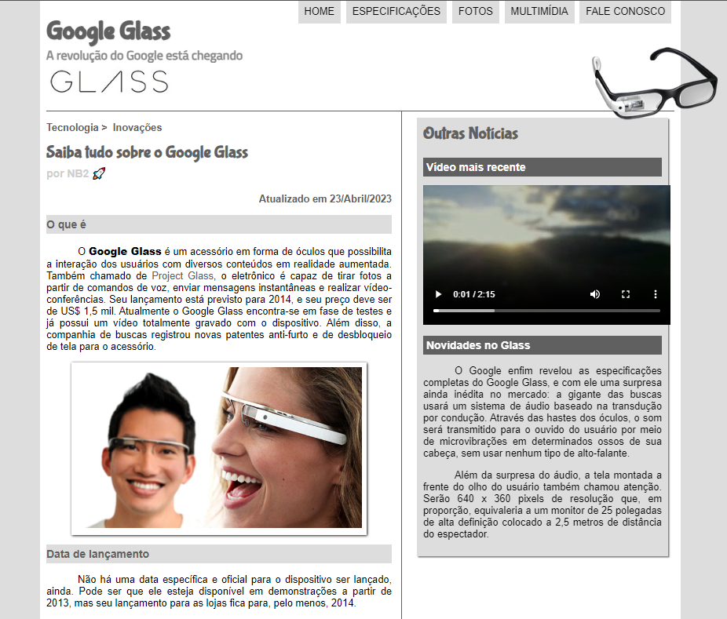

  

## 🚀 Tecnologias

Esse projeto foi desenvolvido com as seguintes tecnologias:

- HTML
- CSS
- JavaScript

## 💻 Projeto

Este projeto tem como finalidade treinar e colocar em prática as tecnlogias acima citadas. Habilidades adquiridas nas aulas de HTML, CSS e Javascript através do seu canal no youtube [Curso em Video](https://www.youtube.com/watch?v=epDCjksKMok&list=PLHz_AreHm4dlAnJ_jJtV29RFxnPHDuk9o) do professor Gustavo Guanabara. 🚀💻